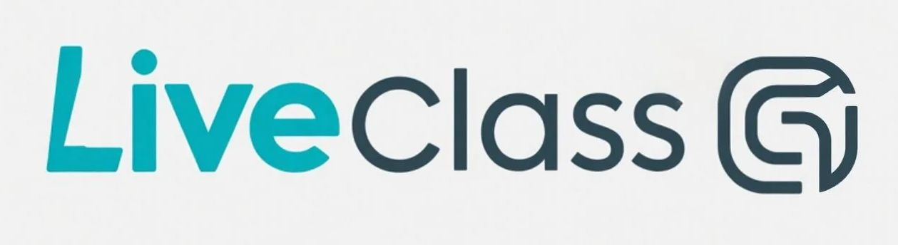
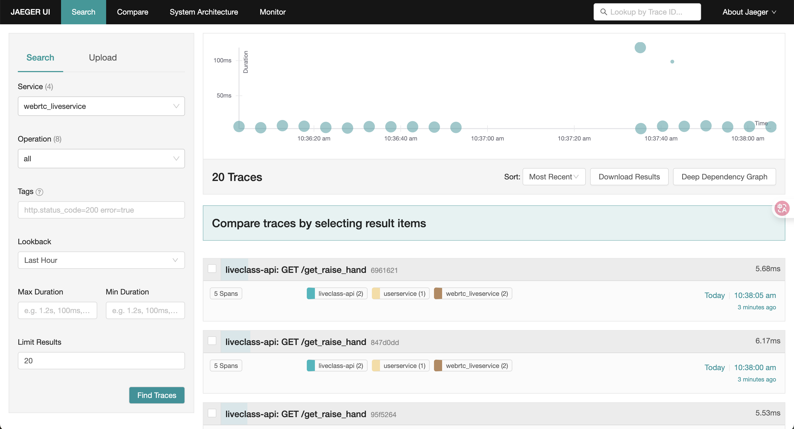
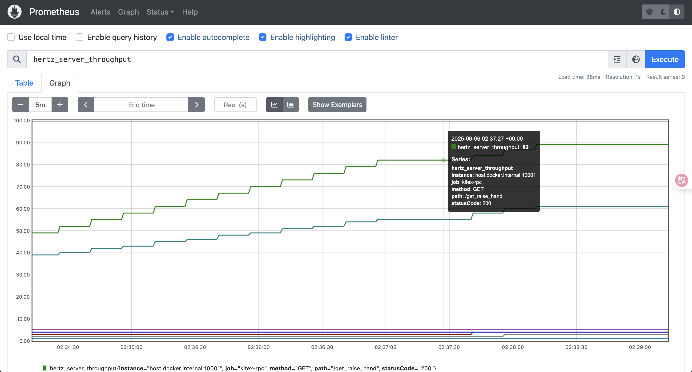
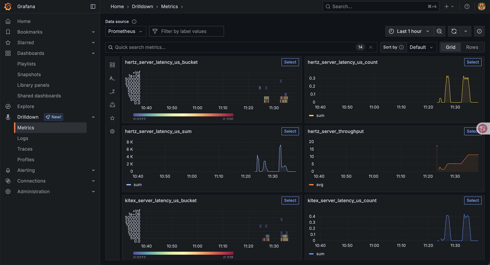

# LiveClass -- 一款新时代的实时课堂

### 概要：

**liveclass集成了许多技术，运用hertz+kitex的分布式架构构成了一个实时在线直播课堂，同时框架一致，扩展性强，API统一管理，RPC服务文件结构格式化，参数传递使用统一接口，学习成本较低，容易扩展开发。包含用户，直播，实时答题，ai智能助教等部分，未来将不断完善(也许，Test代码都没写呢hhh**

### 技术栈（部分）:

- Nginx

- Etcd

- Docker

- Docker-compose

- Mysql

- Redis(存储常修改kv对，热点)

- Redis-stack(向量数据库)

- LUA(保证redis IO操作原子性)

- Hertz

- Kitex(采用分布式架构)

- Eino

- EINO DEV可视化开发

- CozeLoop(扣子罗盘，没有埋span导致目前只能看到input/output，之后完善一下)

- GORM

- JWT

- WebRTC

- RAG

- MCP

- Thrift

- REACT AGENT(ARK DOUBAO EMBEDDING/ARK DOUBAO 32k-pro)

- Viper

- RESTFUL API

- WebSocket

- Livego

- ffmpeg

- Kafka

- MongoDB

- Excalidraw

- 腾讯云COS存储

- Jaeger(链路追踪:localhost:16686)

  
  
  
  
- Prometheus(指标测量:localhost:9090)

  

- Grafana(默认username,password均为admin)，可以查看Prometheus数据

